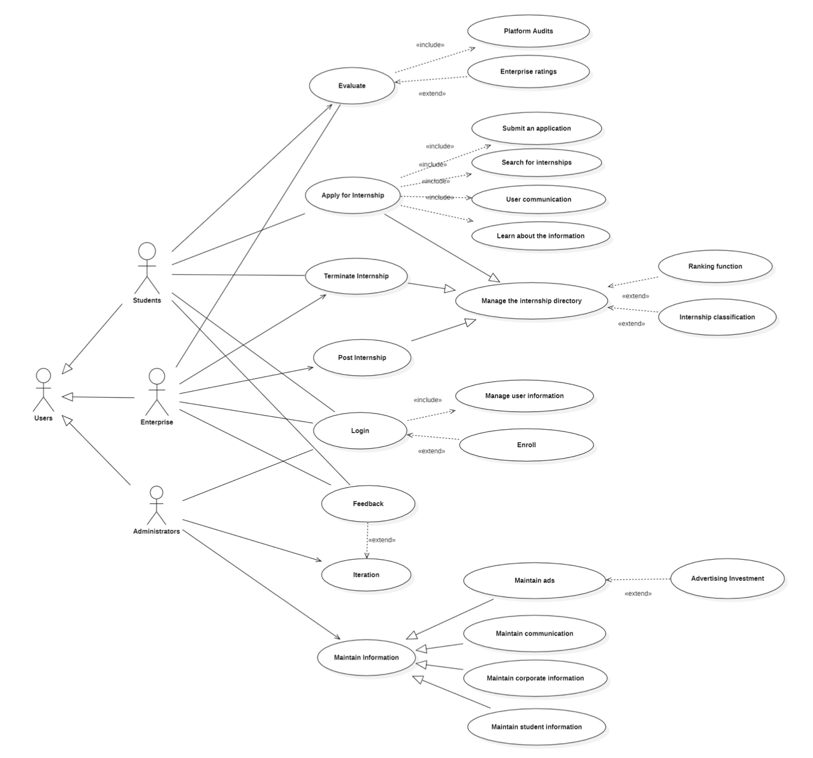
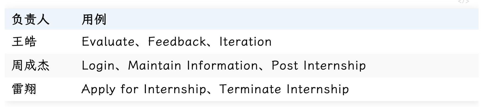

# 实习平台系统：InternHive

>[王浩]() [周成杰]() [雷翔]()

---

# 项目背景

----

## 实习

> 实习是高等教育的重要组成部分，通过实习可以将我们在课堂上学习到的理论知识应用到实际工作中，接触真实的职场环境，最终获得实践经验和未来职业竞争力

绝大多数同学都希望能够找到符合自己专业方向、薪资水平不错的高质量实习，基于这种市场需求，我们开发一款高度可靠和透明的实习平台系统

----

## 解决方案

我们希望搭建一个实习平台

+ 它设计良好、高效
+ 能够促进学生和企业之间的沟通
+ 并为双方提供有价值的反馈

---

# 用户需求

----

## 用户需求

从学生角度：

+ 申请实习岗位，及时获取有价值的实习信息，寻找实习机会
+ 一个能提供实习经验分享和交流的平台，吸取前辈们的经验教训
+ 觉得企业不好，想要提前终止实习
+ 实习结束后，想要分享自己的实习经历，给企业/平台提供建议

<red>帮助学生找到合适的实习</red>

----

## 用户需求

从企业角度：

+ 发布实习岗位，快速找到一个合适的实习生
+ 学生摆烂，企业不想让学生继续实习下去
+ 实习结束后，对学生实习工作进行评价

<red>帮助企业招到优秀的人才</red>

----

## 用户需求

从管理者角度：

+ 允许学生/企业注册，成为平台用户
+ 维护学生/企业的信息，以及实习岗位目录的分类整理
+ 提供企业评级和排名功能，帮助学生找到合适岗位
+ 针对学生/企业提出的问题，能够改进平台功能

<red>减轻平台管理者的管理成本</red>

---

# 平台功能

----

## 主要功能

+ （学生和企业）用户注册
+ （学生）申请实习
+ （学生）评估实习
+ （企业）发布实习
+ （学生和企业）终止实习
+ （学生和企业）反馈意见 平台跟进
+ （平台）迭代更新
+ （平台）维护用户信息

<blue>InternHive</blue>：解决“学生难找到好工作、企业难招到好员工”的问题，能够为学生找到高质量的实习，为企业招到优秀的人才！

----

## 用例图

----

## 重要用例

---

# 敏捷开发

----

## 敏捷开发

> 在系统分析与设计的整个阶段，遵循敏捷开发，强调以用户为中心。在整个开发过程与用户密切合作，以确保最终产品满足客户的需求

+ 用户参与
+ 迭代开发
+ 持续改进

----

##  用户参与

<!-- + 允许用户反馈和提供建议，从而平台管理者来改进优化平台
+ 面对用户需求，提供可定制服务，如岗位排名和按地区分类功能，可根据学生的兴趣、经验和技能为他们提供相关的实习机会 -->

在我们的系统设计中，确保用户参与是至关重要的

我们的系统允许用户反馈和提供建议，从而平台管理者来改进优化平台，即让用户参与进行，将用户反馈整合到平台的设计中，符合敏捷开发的原则

我们的平台设计还包括排名和实习分类，可以根据学生的兴趣、经验和技能为他们提供相关的实习机会

面对用户需求，我们可以提供可定制服务

----

## 迭代开发

<!-- + 将项目分解成更小、更易于管理的模块
+ 例如，“申请实习”用例被分解成更小的用例，如“提交申请”、“搜索实习”和“用户交流”
+ 较小的用例中的每一个都可以独立开发和测试，这允许及早发现和解决问题 -->

> 敏捷开发提倡将项目分解成更小、更易于管理的模块，而不是一次性就完成整个项目。从这个角度来看，我们的系统设计也很好体现了敏捷开发的原则

我们的系统设计将大用例分解成更小的用例，允许频繁的反馈和迭代

例如，“申请实习”用例被分解成更小的用例，如“提交申请”、“搜索实习”和“用户交流”。这些较小的用例中的每一个都可以独立开发和测试，这允许及早发现和解决问题

----

## 持续改进
<!-- 
+ 平台持续接受用户反馈，不断优化平台功能
+ 平台设计灵活，通过使用模块化组件和可扩展的体系结构实现的，可以根据需要轻松修改和更新 -->

> 敏捷开发鼓励在整个开发过程中不断改进和学习。这意味着开发团队不断地寻找方法来改进项目和他们自己的过程，这可以帮助确保最终产品具有最高的质量。从持续改进和学习的角度分析实习平台系统设计，这是敏捷开发的核心原则

实习平台系统：InternHive 设计很好地体现这一原则

+ 允许来自用户的持续反馈，提出的解决方案
    + 通过迭代过程将这些反馈整合到设计中，从而允许平台持续改进和发展
+ 平台设计灵活，使用模块化组件和可扩展的体系结构实现
    + 这允许平台的功能和性能随着时间的推移不断改进
+ 收集并分析用户数据，如用户活动和实习参与度等
    + 这些数据可用于确定需要改进的领域，确保平台不断改进

