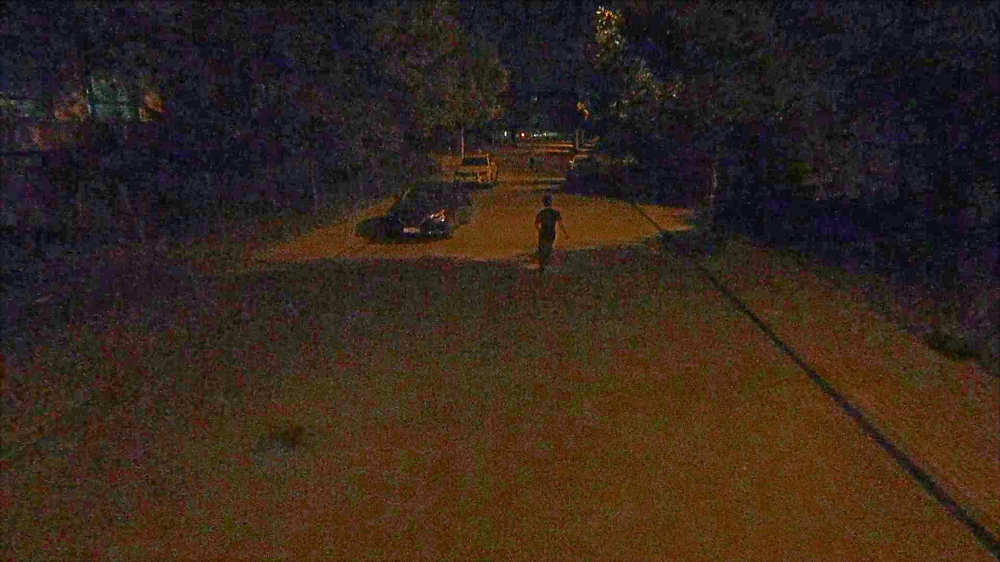
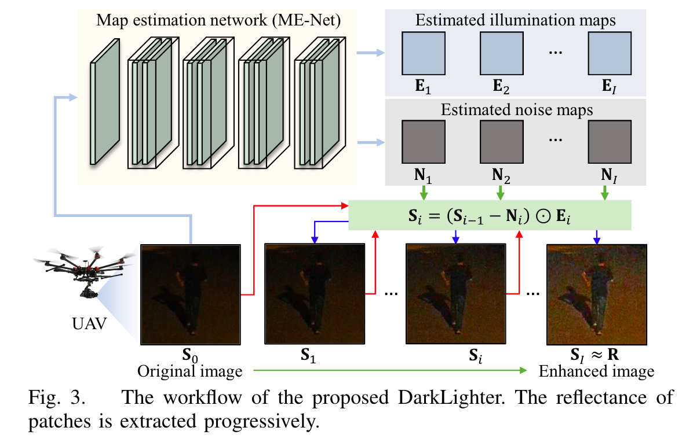
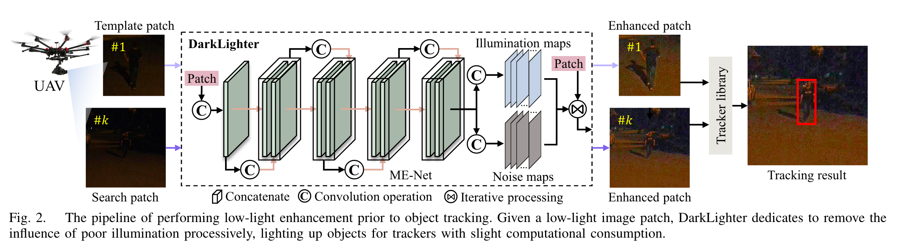
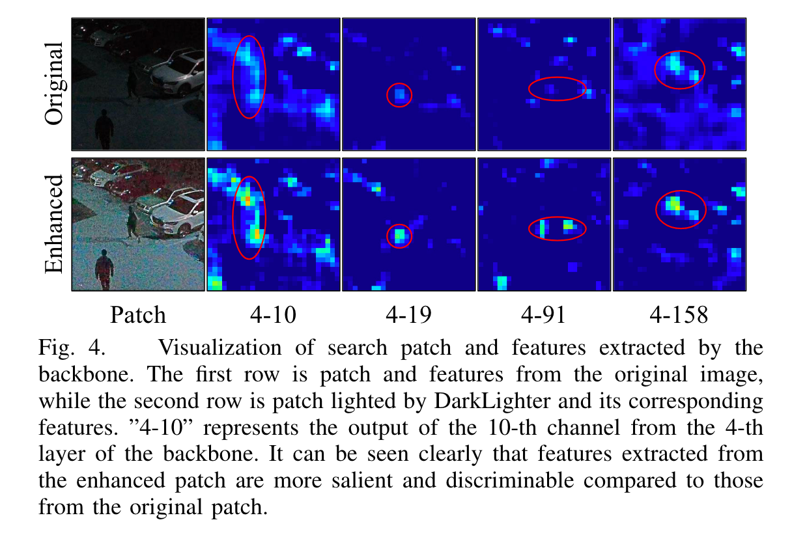
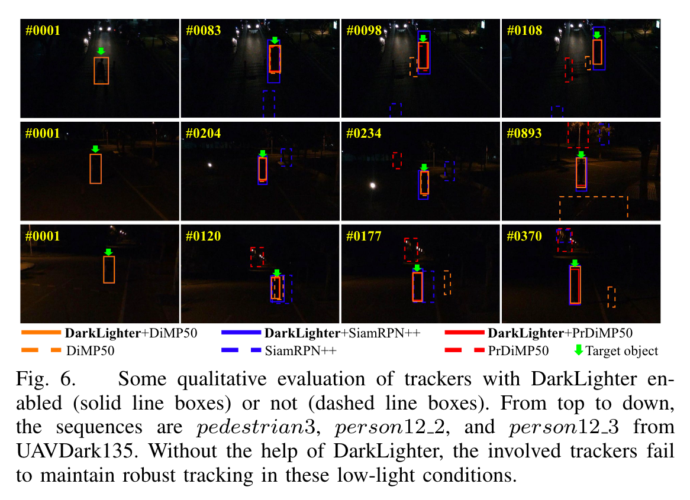

# 低照度环境下无人机视觉追踪研究

>[雷翔](https://github.com/Lei00764)

---

# 研究背景

----

## 视觉跟踪

在无人机领域的应用

+ 目标跟踪
+ 自主着陆
+ 自定位
+ 视觉导航

--

主流研究方向

+ 基于相关滤波器
+ 基于卷积神经网络 CNN

----

## 卷积神经网络

>卷积神经网络具有很好的跟踪性能，成为当前视觉跟踪的主流趋势。这类方法通过大量数据样本的训练，跟踪性能可以达到前沿水平

基于 Siamese 的跟踪算法适合用于机载无人机视觉跟踪

+ 精度好
+ 效率高
+ 在精度和效率之间取得较好的平衡

----

## 夜间低照度条件

捕获的图像具有高噪声、低对比度和低亮度等特点

+ CNN 不能有效提取图像特征，严重影响视觉跟踪的精度
+ 在没有对象特征的情况下，很难保持鲁棒跟踪
+ 基于卷积神经网络 CNN 的跟踪器在低照度环境下表现很差

---

# 解决方案

----

## 低照度图像增强器

对弱光图像进行增强，缓解夜间环境下低照度和噪点的影响

图像增强器 DarkLighter

+ 对原有图像的照度图和噪声图进行处理
+ 在原追踪器上集成 DarkLighter，作为预处理步骤
+ DarkLighter 更关心中心区域

>Retinex 理论：观测图像可以分解为反射率图和照度图。反射率，即被物体反射的光的波长，应该保持恒定，因为它是由物体的性质决定的。因此，反射率可被视为物体的“真实颜色”。不管光线条件如何，用物体的“真实颜色”跟踪它会带来更健壮的性能。

----

## ME-Net

训练 ME-Net 用于在每次迭代中同时估计照度图和噪声图

+ ME-Net 由七个卷积层组成
+ 不断迭代，剥离照度图和噪声图，从而提高图像质量
+ 目标：提高目标区域的反射率，让特征更加明显

----

## 实现流程

附加 DarkLighter 追踪框架实现流程

- 在目标跟踪执行之前使用 DarkLighter
- DarkLighter 能够减缓低照明的影响，为跟踪器照亮对象

---

# 实验效果

----

## 与原始图像对比

经过 DarkLighter 增强的图像提取到的特征更明显，更容易辨别

----

## 在 SOTA 跟踪器上实现

4 个 SOTA 跟踪器

- DiMP50
- PrDiMP50
- SiamAPN
- siamrpn++

DarkLighter 提升了所有相关跟踪器的性能

----

## 实际测试

在一个典型的无人机平台上进行了实现

---

# 结论

----

## 结论

- DarkLighter 可以减轻夜间图像光线暗和噪声多的影响
- DarkLighter 是一个适用于低照度条件跟踪任务的轻量增强器
- DarkLighter 能匹配不同的跟踪算法，具有兼容性
- 实际测试证实了 DarkLighter 的适用性和可靠性