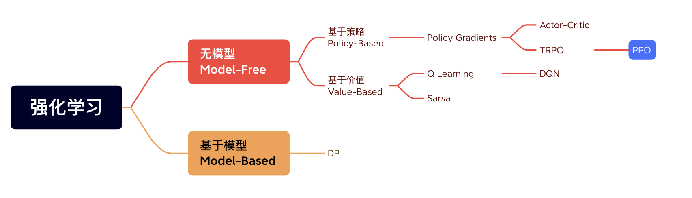

# 基于PPO算法的AI贪吃蛇小游戏

<hr>

>2053932 [雷翔](https://github.com/Lei00764)

---

# PPO 是什么？

----

## 强化学习

> 强化学习：agent在environment中学习，根据环境的state，执行action，并根据reward来指导更好的动作。


----

## 分类



<hr>

+ 按照环境是否已知：Model-Based和Model-free; 
+ 按照学习目标：Value-Based和Policy--Based; 

----

## PPO

> PPO (Proximal Policy Optimization) 是一种用于深度强化学习的优化算法，由OpenAI于2017年提出。

<hr>

+ PPO是一个无模型的基于策略的强化学习算法
+ PPO是OpenAI的默认算法，ChatGPT是使用PPO进行训练
+ 目的：学习在某个状态下，智能体如何做动作


---

# 如何构建游戏？

----

## 环境

> gym是强化学习的标准API，以及各种参考环境的集合。

<hr>


<red> 任务：确定状态空间和动作空间 </red>


TODO : 创建一个 gym 环境，用于模拟贪吃蛇游戏

在环境中，提供reset()、step()和render()这三个方法


<hr>


----

## 模型

+ 使用 StableBaselines3 深度强化学习工具包
+ 网络选择
    + 多层感知机 MLP
    + 卷积神经网络 CNN


----

## 奖励

<red> 任务：根据游戏规则和目标，设计一个奖励函数来引导蛇的行为</red>

+ 奖励是强化学习的灵魂
+ 例如，蛇吃到奖励就给予奖励，撞墙或撞到自己身体给予惩罚
    + 结果：训练出一个只会“苟且偷生”的蛇。
+ 解决方法：设置一个最长步数，超过该步数就扣大量分数

<hr>

+ 更好的奖励
    + 计算蛇头与果子的距离，接近果子加分，远离果子扣分。
    + 这个分数为蛇长度的倒数，随蛇的长度增加逐步衰减。


---

# 训练

----

## 训练分析

```Python
# 采用线性衰减方法
lr_schedule = linear_schedule(2.5e-4, 2.5e-6)  
clip_range_schedule = linear_schedule(0.150, 0.025)  

n_steps = 2048              # 每个训练批次中的步数
batch_size = 512            # 每个训练批次中的样本数
n_epochs = 1                # 训练的轮数
gamma = 0.94                # 折扣因子 计算未来的折扣值
total_timesteps = 10000000  # 训练步数
```


