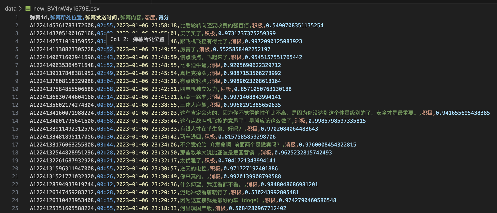

# B站弹幕可视化分析

以比亚迪相关视频为例

>[雷翔]() 

---

# 我做了什么？

----

## 三件事

1.	数据爬取与处理：爬取三个关于比亚迪的视频，并对获取的弹幕数据进行了去重等操作。最终，获得了 29081 条有效数据。
2.	弹幕情感分析：利用 IDEA-CCNL/Erlangshen-Roberta-110M-Sentiment 模型，对弹幕数据进行情感分析。该模型能够判断每条弹幕的情感倾向，表现为积极或消极，同时给出具体的情感得分。
3.	可视化分析：本项目一共绘制了五个图表，包括弹幕发送时间的折线图、不同态度的弹幕数量饼图、不同态度的弹幕分数核密度估计图、关键词词云图以及视频弹幕数量随时间变化的折线图。这五张图表能够直观反映弹幕数量变化、观众的情感态度、不同态度弹幕分数等信息。

----

## 数据爬取与处理

----

## 弹幕情感分析

----

## 可视化分析

